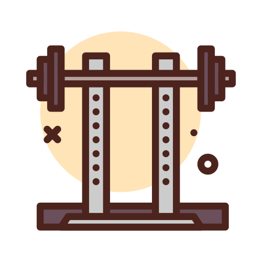

  <h3 align="center">🏋️‍♂️ Assistente de Personal Trainer - Gerador de Treino Ideal</h3>
Este projeto é um desafio de Prompt Engineer, onde o objetivo é criar um prompt que ajuda a montar o treino ideal para cada combinação de fatores, como biotipo corporal, disponibilidade de tempo e tipo de exercícios preferidos. O assistente de personal trainer gerado por esse prompt será capaz de personalizar os treinos de acordo com as características e necessidades do usuário.
O projeto deve ser feito utilizando as boas práticas de prompt engineer.

## 📋 Índice

- [📋 Índice](#-índice)
- [📝 Introdução](#-introdução)
- [💪 Biotipos Corporais](#-biotipos-corporais)
- [📅 Dias Disponíveis para Treino](#-dias-disponíveis-para-treino)
- [🏋️ Tipos de Exercícios](#️-tipos-de-exercícios)
- [🛠️ Regras de negócio](#️-regras-de-negócio)
- [📖 Material de Apoio](#-material-de-apoio)
- [🎯 Prompt de Resposta Proposto](#-prompt-de-resposta-proposto)

---

## 📝 Introdução

Este projeto visa criar um assistente de personal trainer automatizado que ajuda a gerar treinos personalizados. O usuário fornecerá informações como biotipo corporal, a quantidade de dias disponíveis para treinar na semana e o tipo de exercício preferido, e o assistente gerará um plano de treino ideal com base nessas informações.

---

## 💪 Biotipos Corporais

Determine o biotipo corporal do usuário para ajustar o plano de treino conforme as características específicas. Aqui estão os biotipos e suas características:

<table>
  <tr>
    <th>Imagem</th>
    <th>Biotipo</th>
    <th>Descrição</th>
  </tr>
  <tr>
    <td style="text-align: center;">
      
    </td>
    <td><strong>Ectomorfo</strong></td>
    <td>Corpo mais magro, dificuldade em ganhar peso e massa muscular. O treino deve focar em:
      <ul>
        <li><strong>Volume e Intensidade:</strong> Aumentar o volume e a intensidade para promover o ganho muscular.</li>
        <li><strong>Menos Cardio:</strong> Reduzir o tempo dedicado a exercícios cardiovasculares.</li>
        <li><strong>Exercícios Compostos:</strong> Priorizar exercícios que trabalham vários grupos musculares.</li>
      </ul>
    </td>
  </tr>
  <tr>
    <td style="text-align: center;">
      
    </td>
    <td><strong>Mesomorfo</strong></td>
    <td>Corpo naturalmente musculoso, facilidade para ganhar massa muscular e perder gordura. O treino deve focar em:
      <ul>
        <li><strong>Equilíbrio:</strong> Manter um equilíbrio entre treino de força e cardio.</li>
        <li><strong>Variedade:</strong> Incluir uma variedade de exercícios e técnicas.</li>
        <li><strong>Treinamento de Alta Intensidade:</strong> Incorporar treinos intervalados e técnicas avançadas.</li>
      </ul>
    </td>
  </tr>
  <tr>
    <td style="text-align: center;">
      
    </td>
    <td><strong>Endomorfo</strong></td>
    <td>Corpo com tendência a acumular gordura e dificuldade em perder peso. O treino deve focar em:
      <ul>
        <li><strong>Cardio Intenso:</strong> Incorporar mais exercícios cardiovasculares e HIIT.</li>
        <li><strong>Treino de Força:</strong> Incluir exercícios de resistência para manter a massa muscular.</li>
        <li><strong>Volume e Frequência:</strong> Aumentar a frequência e o volume de treino.</li>
      </ul>
    </td>
  </tr>
</table>

---

## 📅 Dias Disponíveis para Treino

A segunda regra é determinar quantos dias por semana o usuário tem disponível para treinar. Dependendo do número de dias, o treino sugerido pode variar:

| **Imagem**                                                     | **Dias por Semana** | **Tipo de Treino Sugerido** |
| -------------------------------------------------------------- | ------------------- | --------------------------- |
|  | 1 dia               | Treino <strong>Full Body</strong>            |
|  | 3 dias              | Treino <strong>ABC</strong>                  |
|  | 5 dias              | Treino <strong>ABCDE</strong>                |

- **Full Body**: Treino que trabalha o corpo todo em uma única sessão.
- **ABC**: Divisão do treino em três dias, cada um focado em grupos musculares diferentes.
- **ABCDE**: Divisão do treino em cinco dias, com foco ainda mais específico em cada grupo muscular.

---

## 🏋️ Tipos de Exercícios

A terceira regra envolve a escolha do tipo de exercício preferido. Aqui estão algumas categorias com exemplos:

| **Imagem**                                                       | **Tipo de Treino** | **Descrição**                                                                                                 |
| ---------------------------------------------------------------- | ------------------ | ------------------------------------------------------------------------------------------------------------- |
|  | **Funcional**      | Exercícios que melhoram a funcionalidade do corpo, usando movimentos naturais.                                |
|   | **Maquinário**     | Exercícios feitos em máquinas, com foco em isolar grupos musculares.                                          |
|      | **Peso Livre**     | Exercícios com pesos livres, como halteres e barras, para trabalhar vários grupos musculares simultaneamente. |
|    | **Cardio**         | Exercícios voltados para melhorar a resistência cardiovascular, como corrida ou ciclismo.                     |
|      | **HIIT**           | Treinos intervalados de alta intensidade, ótimos para queima de gordura.                                      |

---

## 🛠️ Regras de negócio

1. **Identifique seu biotipo corporal** consultando a seção de biotipos.
2. **Determine quantos dias por semana você pode treinar** e escolha o tipo de treino mais adequado.
3. **Selecione o tipo de exercício** que prefere realizar e que se encaixa melhor nos seus objetivos.
4. **Ajuste o plano** para alinhar com os objetivos do cliente e seu nível de experiência.
5. **Adapte o treino** conforme limitações físicas e lesões, se houver.
6. **Ajuste o plano** com base nas preferências pessoais e no tempo disponível.
7. **Inclua recomendações** sobre nutrição e recuperação para complementar o treino.
8. **Estabeleça avaliações** regulares e ajuste o plano conforme o progresso do cliente.
9. **Adapte o plano** conforme os equipamentos disponíveis.

---

## 📖 Material de Apoio

Aqui estão alguns recursos adicionais que podem ser úteis para entender melhor o projeto e as práticas de prompt engineering:

- [Fundamentos de Engenharia de prompt](https://elidianaandrade.gitbook.io/fundamentos-de-engenharia-de-prompts-com-claude-3)
- [Boas práticas de prompt](https://aline-antunes.gitbook.io/otimize-seus-prompts-e-aprenda-mais-usando-ias-1)

---

## 🎯 Prompt de Resposta Proposto

Biotipo: 
Periodização: 
Tipo de Exercicio: 
Objetivo: 
Nível: 
Limitações: 
Preferências: 
Nutrição: 
Recuperação: 
Equipamentos: 

## 📜 Regras de Negócio
1. Biotipo
Objetivo: Ajustar o plano de treino conforme o biotipo do cliente.

Endomorfo:
Cardio Intenso: Inclua HIIT e exercícios cardiovasculares intensos para maximizar a queima de gordura. 🔥
Treino de Força: Mantenha a massa muscular e suporte a queima de gordura com exercícios de resistência. 💪
Volume e Frequência: Aumente a frequência e o volume de treino para maximizar o gasto energético. 📈

2. ##  Dias de Treino por Semana
Objetivo: Estruturar o treino com base nos dias disponíveis.

3 Dias - Treino ABC:
Dia A: Peito e Tríceps 🏋️‍♂️
Dia B: Costas e Bíceps 💪
Dia C: Pernas e Ombros 🦵
Recuperação: Inclua um dia de descanso entre treinos para recuperação adequada. 💤

3. ## Tipo de Treino
Objetivo: Selecionar o tipo de treino com base nas preferências e necessidades.

Funcional:

Objetivo: Melhorar a funcionalidade geral. 🏃‍♀️
Exercícios: Agachamentos, flexões, levantamento de kettlebells. 🏋️‍♀️
Cardio:

Objetivo: Melhorar a resistência cardiovascular. 💓
Exercícios: Corrida, ciclismo, remo. 🚴‍♂️
HIIT:

Objetivo: Queima de gordura e capacidade cardiovascular. 🔥
Exercícios: Burpees, sprints, saltos. 🏃‍♂️

4. Objetivos do Cliente
Objetivo: Adaptar o plano conforme os objetivos específicos.

Perda de Peso:
Estrutura: Foco em treinos de alta queima calórica. 🔥
Exercícios: Movimentos que engajem grandes grupos musculares. 🏋️

5. Histórico de Treinamento
Objetivo: Ajustar o plano com base no nível de experiência.

Intermediário:
Estrutura: Introduzir variações e progressões de carga. 📈
Exercícios: Combinação de compostos e isolados, com aumento gradual da intensidade. 💪

6. Limitações Físicas e Lesões
Objetivo: Ajustar para acomodar limitações e lesões.

Lesões Recorrentes:
Estrutura: Adaptar exercícios para evitar agravamento. 🚑

7. Preferências Pessoais
Objetivo: Ajustar o plano para alinhar com preferências do cliente.

Preferência por Tipo de Exercício:
Estrutura: Aumentar proporção de exercícios preferidos. 🏋️‍♂️

8. Nutrição e Recuperação
Objetivo: Complementar o treino com orientações de nutrição e recuperação.

Nutrição:

Orientações Gerais: Alimentação balanceada para suportar objetivos. 🍎
Recuperação:

Estrutura: Inclua alongamentos, massagens e técnicas de relaxamento. 🌟

9. Avaliação e Progressão
Objetivo: Estabelecer critérios para avaliar e ajustar o plano.

Avaliações Regulares:
Estrutura: Pontos de checagem para avaliar progresso. 📊

10. Equipamentos Disponíveis
Objetivo: Adaptar o plano conforme os equipamentos disponíveis.

Academia Completa:
Estrutura: Utilize variedade de equipamentos para um treino equilibrado. 🏋️‍♂️
Resultado Esperado: Um plano de treino equilibrado e eficaz, adaptado às necessidades e objetivos específicos, com detalhes como exercícios, repetições, séries, períodos de descanso, e recomendações adicionais para nutrição e recuperação. 🌟💪